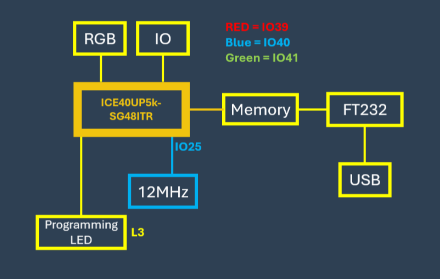

# 🚀 VSDSquadron FPGA Mini (FM) - FSM FPGA Design Flow

This document provides an overview of the **VSDSquadron FPGA Mini (FM)** board and details the usage of essential commands in the FSM (Finite State Machine) FPGA design flow.

---

## 📋 Table of Contents

- [Board Overview](#board-overview)
- [Software Installation](#Software-Installaion).
- [Specifications](#specifications)
- [Command Breakdown](#command-breakdown)
  - [`make`](#1️⃣-make)
  - [`make build`](#2️⃣-make-build)
  - [`sudo make flash`](#3️⃣-sudo-make-flash)
  - 
- [Example Makefile Snippet](#example-makefile-snippet)
- [Full Workflow Example](#full-workflow-example)
- [Notes](#notes)
- [Tools Typically Used](#tools-typically-used)
- [Summary](#summary)
- [Getting Started](#getting-started)
- [Documentation and Support](#documentation-and-support)

---

## Board Overview

The **VSDSquadron FPGA Mini (FM)** is a compact and cost-effective development board designed for FPGA prototyping and embedded system projects. It offers a seamless hardware development experience with an integrated programmer, versatile GPIO access, and onboard memory, making it ideal for students, hobbyists, and developers exploring FPGA-based designs.


---

## Specifications and Pinouts

- **FPGA Chip:** Lattice UltraPlus ICE40UP5K
  - Logic Cells: 5,280
  - SPRAM: 1Mb
  - DPRAM: 120Kb
  - Multipliers: 8

- **Connectivity:** FTDI FT232H USB-to-SPI for programming and communication

- **GPIO:** 32 accessible FPGA GPIOs

- **Memory:** 4MB SPI flash for data storage and configuration

- **LED Indicators:** RGB LED for status indication

- **Power Regulation:** Onboard 3.3V and 1.2V regulators with external supply option

- **Dimensions:** 57mm x 29mm

| Feature                 | Specification                             |
|-------------------------|-------------------------------------------|
| Technology Node         | 40 nm                                     |
| Logic Cells             | 5,280                                     |
| Flip-Flops              | 4,960                                     |
| SRAM Blocks             | 120 Kbits                                 |
| DSP Blocks              | None                                      |
| Package Type            | SG48                                      |
| I/O Pins                | 39                                        |
| I/O Standards           | LVCMOS, LVDS                              |
| Max Operating Frequency | 133 MHz                                   |
| Clock Sources           | Internal oscillator, external clock       |
| Core Voltage            | 1.2V                                      |
| I/O Voltage             | 3.3V, 2.5V, 1.8V                          |
| Operating Temp Range    | -40°C to 85°C                             |
| Development Tools       | Project IceStorm, Yosys, NextPNR          |

---

## 🗂 FPGA IO Pin Mapping (Partial)
| FPGA Pin     | Type             | Bank | Notes / Connections                 |
|------------- |------------------|------|-------------------------------------|
| IOB 0a       | PIO              | 2    | Pin 46                              |
| IOB 2a       | DPIO             | 2    | TRUE of IOB 3b - Pin 47             |
| IOB 3b       | DPIO/GBIN        | 2    | COMP of IOB 2a - Pin 44             |
| IOB 4a       | DPIO             | 2    | TRUE of IOB 5b - Pin 48             |
| IOB 5b       | DPIO             | 2    | COMP of IOB 4a - Pin 45             |
| IOB 6a       | PIO              | 2    | Pin 2                               |
| IOB 8a       | DPIO             | 2    | TRUE of IOB 9b - Pin 4              |
| IOB 9b       | DPIO             | 2    | COMP of IOB 8a - Pin 3              |
| ...          | ...              | ...  | ...                                 |
| IOB 32a      | SPI SO           | SPI  | Pin 14                              |
| IOB 33b      | SPI SI           | SPI  | Pin 17                              |
| IOB 34a      | SPI SCK          | SPI  | Pin 15                              |
| IOB 35b      | SPI SS           | SPI  | Pin 16                              |
| RGB0         | LED              | -    | Pin 39                              |
| RGB1         | LED              | -    | Pin 40                              |
| RGB2         | LED              | -    | Pin 41                              |

**Note:** Full pin mapping available in the datasheet.

---

## 🟢 Power and Other Signals
- **VCC (Core Power):** Pins 5, 30
- **VCCIO (I/O Power):** Pins 1 (VCCIO2), 22 (SPI VCCIO1), 33 (VCCIO0)
- **GND:** Ground - Paddle and multiple pins
- **VPP (Programming Power):** Pin 24 (2.5V)

---

## 📌 Additional Features
- **4MB SPI Flash**
- **FTDI FT232H USB to SPI**
- **RGB LED indicators**
- **Onboard 3.3V and 1.2V Regulators**
- **32 GPIO accessible for prototyping**
- **Form Factor:** 57mm x 29mm, Height: Top 8mm, Bottom 1mm

---

---
# ⚙️ VSDSquadron FM FPGA - Software Installation Guide

This guide helps you set up the **VSDSquadron FPGA Mini (FM)** board on your system and run your first project.

---

## 📥 Required Software and Resources
- **VirtualBox** (Download: https://www.virtualbox.org/wiki/Downloads)
- **VSDSquadron FPGA Mini (FM) Software Package**
  - Download Link: https://forgefunder.com/~kunal/vsdsquadron_fpga_mini.zip
- Minimum **100GB free disk space** on `C:` or `D:` drive
- **4GB RAM** and **4 CPU cores** recommended
- **VDI file** provided inside the software package

---

## 💻 Installation Instructions (Windows Users)

### 1️⃣ Check Disk Space
Ensure you have at least **100GB free**.

### 2️⃣ Download and Extract Software
- Download the **VSDSquadron software zip** package.
- Extract it to a known location.

### 3️⃣ Install VirtualBox
- Download and install **Oracle VirtualBox**.

### 4️⃣ Create a Virtual Machine
- Open VirtualBox → **New** → Enter details:
  - Name: *VSDSquadron_FPGA*
  - Type: *Linux*
  - Version: *Xubuntu (64-bit)*
- Allocate:
  - **RAM:** 4096 MB
  - **CPU:** 4 cores

### 5️⃣ Select the VDI File
- In hard disk settings, select: **Use an existing virtual hard disk file**
- Browse to the extracted **.VDI file**

### 6️⃣ Start the Virtual Machine
- Boot the VM and login with:
  - **Username:** vsdiat
  - **Password:** vsdiat

---

## 📂 Running the Example Project (Blink LED)

### 1️⃣ Open Terminal in VM
- Right-click on desktop → Open Terminal

### 2️⃣ Navigate to Project Folder
```bash
cd VSDSquadron_FM
cd blink_led
```

### 3️⃣ Connect the Board to VM
- **Connect FPGA board via USB**
- In VirtualBox → **Devices → USB → FTDI Single RS232-HS**
- Verify connection:
```bash
lsusb
```
- Look for **"Future Technology Devices International"**

---

## 🛠 Programming the Board

### Clean previous builds:
```bash
make clean
```

### Build binaries:
```bash
make build
```

### Flash to FPGA:
```bash
sudo make flash
```

✅ **If successful:** RGB LEDs on the board will blink.

---

## 📝 Troubleshooting:
- If flashing fails, reconnect the board and select **Devices → USB → FTDI Single RS232-HS** again.
- Retry `sudo make flash`.

---

## Command Breakdown

### 1️⃣ `make`

**Purpose:**  
Compiles the Verilog design files.

**What Happens:**  
- Runs synthesis and simulation tasks.
- Generates intermediate files like `.json`, `.vvp`, or `.bin`.

**Usage:**
```bash
make
```

---

### 2️⃣ `make build`

**Purpose:**  
Builds the design and prepares the FPGA bitstream.

**What Happens:**  
- Maps the synthesized design to FPGA constraints.
- Generates the final FPGA-ready binary or bitstream (e.g., `top.bin` or `top.bit`).

**Usage:**
```bash
make build
```

---

### 3️⃣ `sudo make flash`

**Purpose:**  
Flashes (uploads) the generated bitstream or binary to the FPGA hardware.

**Why `sudo`?**  
- Flashing often requires USB/JTAG access, needing root permissions.

**Usage:**
```bash
sudo make flash
```

---

## Example Makefile Snippet

```makefile
build:
    yosys -p "synth_ice40 -top top -json top.json" top.v
    nextpnr-ice40 --hx8k --json top.json --asc top.asc
    icepack top.asc top.bin

flash:
    iceprog top.bin
```

---

## Full Workflow Example

```bash
make            # Synthesize and simulate the Verilog FSM
make build      # Generate bitstream for FPGA
sudo make flash # Flash the bitstream onto the FPGA board
```

---

## Notes

- Toolchains and flashing commands might vary based on your FPGA board (e.g., iCEBreaker, Arty).
- Replace `iceprog` with `openFPGALoader` or `vivado` for other FPGA platforms.
- Always check hardware permissions; `sudo` may be required for flashing.

---

## Tools Typically Used

- **Yosys:** Synthesis
- **NextPNR:** Place & Route
- **icepack / Vivado / openFPGALoader:** Bitstream generation
- **iceprog / openFPGALoader:** Flashing to FPGA hardware

---

## Summary

| Command           | Description                             |
|-------------------|-----------------------------------------|
| `make`            | Compile and synthesize Verilog code     |
| `make build`      | Generate FPGA-ready bitstream           |
| `sudo make flash` | Upload bitstream to the FPGA hardware   |

---

## Getting Started

- **Software Tools Required:** Project Icestorm, Yosys, NextPNR
- **Programming:** Onboard FTDI FT232H enables USB-based programming.
- **First Project:** A preloaded "blink LED" example is included for quick testing.

---

